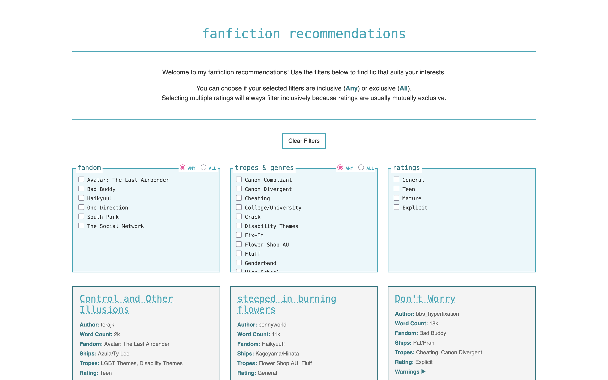
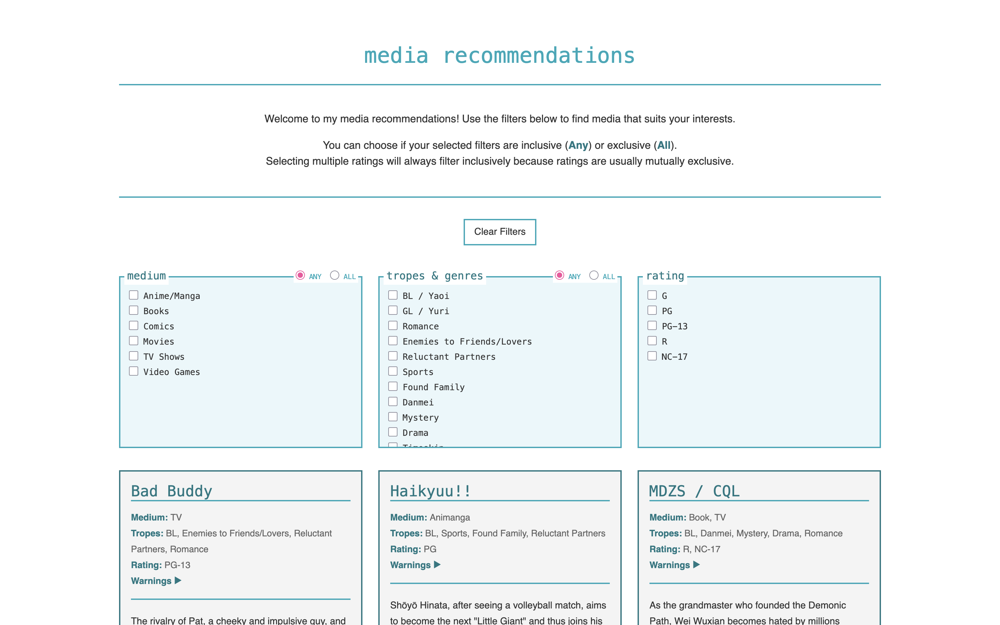
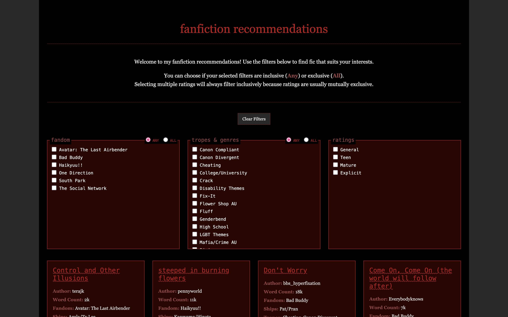

# Rec Page Templates

A set of templates for media and fanfiction recommendation pages.

See https://fan.kingdra.net/recs for full documentation and customization options.

---

## Table of Contents

1. [About](#about)  
2. [Features](#features-both-templates)  
3. [Fanfiction Template Differences](#fanfiction-template-differences)  
4. [Installation](#installation)  
5. [Previews](#previews)

---

# About

These are templates for rec pages on an independent website where you can create `.html` and `.css` files (at minimum), applying filters with JavaScript.

The templates have been pre-formatted for media and fanfiction recommendations in mind, but you can use them for whatever you want.

Full documentation: https://fan.kingdra.net/recs

---

# Features (both templates)

- **Three (3)** category filters
- **Any** (inclusive) / **All** (exclusive) options for users to choose how each category filter works
- **Clear Filters** to reset all selected filters  
  *This will also toggle all filter modes back to "Any".*
- Results will automatically update based on the selected tags and filter mode, and expand/shrink per number of results
- Warnings show on click, but not by default
- A formatted field for personal thoughts on each rec
- Responsive styling for tablets and mobile devices

---

# Fanfiction Template Differences

- The **Medium** category has been changed to a **Fandom** category
- Additional metadata for: **Link**, **Author**, **Word Count**, and **Ships**
- Rec titles use `<h3&>` instead of `<h2>` (for media recs), without a border bottom
- Rec titles include a **link to the work**, opening in a new tab

Instructions for use and customization are within the code of each webpage template, in addition to the documentation below.

---

# Installation

1. Go to the preview template for [media recs](https://fan.kingdra.net/recs/media) or [fanfiction recs](https://fan.kingdra.net/recs/fanfiction), depending on which template you would like to use. You may use both.

2. On the template webpage, right click and select *View Page Source*.

3. Copy the entire page/file of what comes up. Save it in a `.html` file. This may be a local file or a file on your Neocities/Nekoweb site. Name it whatever you want.

4. Open the `.html` file in a text editor (or your host's in-browser text editor), and modify it to your heart's content with your own text.

5. Manually add and order labels for your rec filters in each category, under `
`. See **Basic Customizations** for more detail.

`<label><input type="checkbox" name="category" value="Tag"> Tag (display text)</label>`

6. I advise you to not remove or modify the rating tags, as they are pretty standard. For media recs, you may also only want to do minimal edits to medium depending on what you are recommending.

7. In the code, find and follow:

`/** Below are my recs. Delete them and replace with your own. (You can delete this line as well) **/`

8. See **Basic Customizations** in the [full documentation](https://fan.kingdra.net/recs/) add your own recs. Once you've added them, you're mostly done with the `.html` file. (Some exceptions may apply.)

9. Now, go to the rec templates' `style.css` and copy/paste everything into your own `style.css` file. Save it in the same folder as your `.html` file.

    - Note: Both the media and the fanfiction templates use the same style.css, so you only need one if you are using both templates and want them to feature the same colors/styling.

    - If you would like them to be different, see **Advanced Customizations** in the [full documentation](https://fan.kingdra.net/recs/).

10. In `style.css`, modify the variables under `:root{}` to reflect colors, fonts, and other styles you prefer. This is not necessary if you would like your page to be styled like the preview.

---

# Previews

